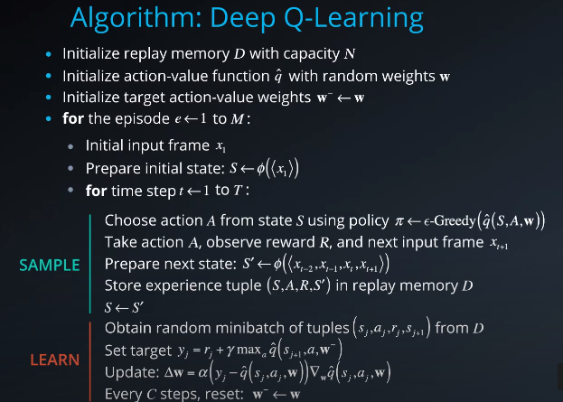
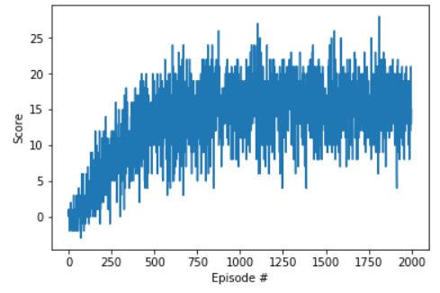

# Report: Deep Reinforcement Learning Nanodegree Project 1 Navigation
### Deep Q-Network with experience replay and fixed target

In the implementation, the deep Q-Networks is utilized.
- The dimension of the input layer of the network is 37, as same as the dimension of the state space.
- The dimension of the first hidden layer of the network is 64, the dimension of the second hidden layer of the network is 64. There are 2 hidden layer in total.
- The dimension of the output layer is 4, as same as the dimension of the action space.

#### Hyperparameters
In this deep network, the hyperparameters are listed as follows:
- Learning rate = 5e-4
- discount factor = 0.99
- buffer size = 1e5
- batch size = 64

### Plots of Rewards

### Idea for future work
To further improve the performance of the agent, we have a few options:
- Double DQN
- Prioritized experience replay
- Dueling DQN
- Rainbow
